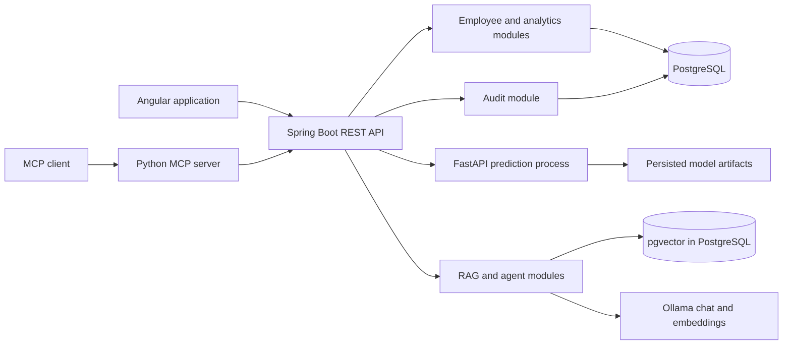
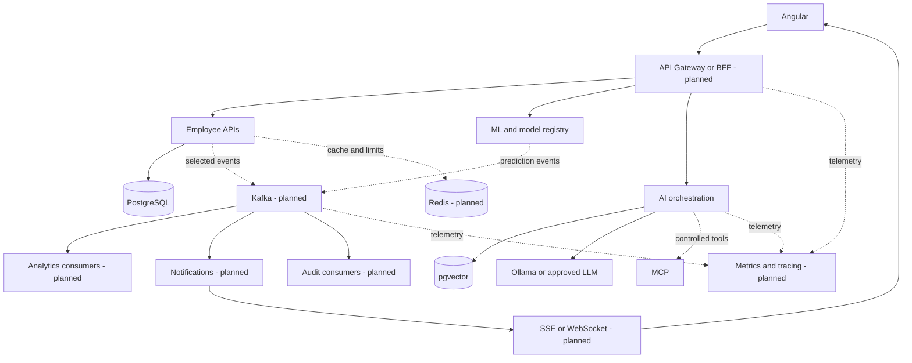
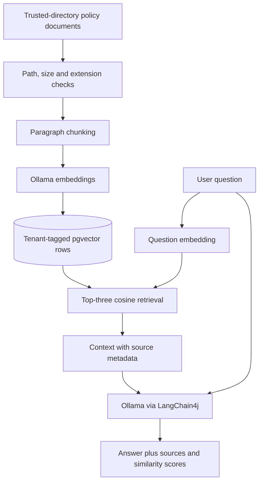
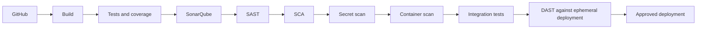

# Nexora Workforce Intelligence & AI Platform

**Workforce operations, predictive analytics, and evidence-grounded HR assistance.**

Nexora Technologies is a **fictional company** used for this engineering portfolio. This repository is not an internal system of a real employer. It evolves the existing Employee Intelligence Platform; it does not replace it with a new application.

> **Engineering status — reviewed 11 October 2026:** production-oriented, not production-ready. Employee and prediction workflows have automated checks, but the latest backend has an unresolved database migration/startup verification gap. Secure login, complete tenant-isolation validation, and end-to-end deployment are unfinished. See [Limitations](#limitations) before running a demonstration.

Status vocabulary used throughout:

- **IMPLEMENTED:** a bounded capability has implementation and verification evidence; this does not certify the whole platform.
- **IN PROGRESS:** code or configuration exists, but functionality, integration, or verification is incomplete.
- **PLANNED:** an architectural direction, not an available product feature.

## Executive Summary

Nexora is a production-oriented enterprise Workforce Intelligence & AI Platform combining employee operations, workforce analytics, Python-based predictions, and document-grounded assistance. Angular provides the user interface; Java/Spring Boot owns business APIs and authorization; PostgreSQL stores transactional data and pgvector supports semantic retrieval. FastAPI serves Scikit-learn models. Ollama and LangChain4j provide LLM, embedding, RAG, and tool-using agent foundations. A separate MCP server exposes selected enterprise capabilities.

The target architecture extends these foundations with **Kafka, Redis, GraphQL, selective gRPC, observability, and DevSecOps**. These technologies are planned, not represented as deployed services. Security and AI security are explicit engineering workstreams, with existing RBAC controls and significant remaining verification work.

The business objective is decision support with traceable evidence, not automated employment decisions. No prediction should independently determine compensation, promotion, performance action, or termination.

## Business Problem

Workforce decisions often require reconciling fragmented employee records, aggregate statistics, predictive signals, and policy documents. Separate dashboards and opaque model outputs can obscure data provenance and create inconsistent access to sensitive information.

The platform brings those concerns into a common workflow: find an employee, inspect relevant workforce context, request an explicitly limited prediction, and consult policy evidence. The enterprise design must also explain who accessed the information, which model or document informed the result, and what requires human review.

## Business Capabilities

| Capability | Status | Current scope |
| --- | --- | --- |
| Employee Management | IMPLEMENTED | CRUD, search, filtering, pagination, sorting; tenant migration currently blocks full-stack startup verification |
| Employee 360 | IN PROGRESS | Profile and intelligence sections; historical timeline and comprehensive audit integration remain |
| Workforce Analytics | IN PROGRESS | Dashboard summary and department aggregation; longitudinal analytics remain |
| Attrition Prediction | IMPLEMENTED | Existing persisted classifier and threshold-based inference |
| Salary Prediction | IMPLEMENTED | Experimental random-forest regression with explicit training and evaluation metadata |
| Performance Prediction | IN PROGRESS | Classifier and API exist; feature timing/leakage review remains |
| Promotion Prediction | IN PROGRESS | Rule-based readiness only; no historical promotion target and a request-contract defect |
| Workforce Risk Intelligence | IN PROGRESS | Composite heuristic over model/rule outputs; not a validated risk measure |
| HR Knowledge Assistant / RAG | IN PROGRESS | Document ingestion, semantic retrieval, answer/source contract; live and security validation remain |
| Agentic AI | IN PROGRESS | LangChain4j tool registration and agent endpoint |
| MCP | IN PROGRESS | Four tool definitions; secure identity propagation and runtime verification remain |
| AI Reports / Real-Time Alerts | PLANNED | No completed reporting or notification delivery pipeline |
| Audit | IN PROGRESS | Selected events, persistence, paged reads and UI; coverage/durability incomplete |
| AI Governance | IN PROGRESS | Version/limitation metadata and decision-support disclosures; review/override workflow planned |

## Architecture

### Current deployment boundaries

The Spring application is a modular-monolith foundation, not a fleet of independently deployed business services. Its internal boundaries still need cleanup. ML inference and MCP are separate Python processes. No dedicated gateway or identity service is shipped.



These arrows describe implemented call paths, not proof of a currently healthy integrated deployment. The Java agent currently uses in-process tools; it is not demonstrated as an MCP-backed agent.

### Target evolution — PLANNED additions



## Architecture Principles

- **Domain-driven boundaries:** isolate employee, prediction, knowledge, and audit responsibilities before extracting deployable services.
- **API-first design:** preserve REST contracts and introduce explicit DTO validation; GraphQL is reserved for justified aggregation.
- **Event-driven architecture:** publish meaningful business events, not every read or internal method call. Kafka is planned.
- **Asynchronous processing:** reserve background jobs for reports, ingestion, and notifications; return synchronous results when the caller needs them immediately.
- **Least privilege and zero-trust principles:** backend authorization is authoritative. Network location, an LLM response, or a frontend role check must not grant access. Full enforcement remains in progress.
- **Observability and resilience:** failures should be diagnosable and dependency failures isolated. Comprehensive telemetry and resilience policies remain planned.
- **Testability:** verify boundary behavior, invalid input, authorization, and dependency failure, not only object construction.
- **Cloud readiness:** prefer portable runtime configuration, containers, and managed-service interfaces over cloud-specific business logic.

## Technology Stack

The table lists technologies present in source/configuration, not a blanket deployment certification.

| Category | Technology | Purpose |
| --- | --- | --- |
| Backend | Java 21 target, Spring Boot 4.0.8, Spring MVC | Business REST API and service orchestration |
| Persistence | Spring Data JPA, Hibernate, JDBC | Entity persistence and vector SQL |
| Security | Spring Security, OAuth2 Resource Server | JWT validation configuration and role checks |
| Database | PostgreSQL 17, pgvector | Employee/audit records and embeddings |
| Schema | Flyway scripts V1–V4 | Versioned schema; startup wiring/upgrade verification unfinished |
| Frontend | Angular 21.2, TypeScript 5.9, RxJS | Routed application and API interaction |
| Frontend runtime | Angular SSR, Express | Server output and prerendering configuration |
| ML | Python, Pandas, NumPy, Scikit-learn, Joblib | Data preparation, training and persisted inference |
| ML API | FastAPI, Pydantic, Uvicorn | Prediction contracts and HTTP serving |
| GenAI | Ollama, LangChain4j | Chat, embeddings, retrieval and tool calling |
| Tools | Python MCP SDK, Requests | MCP-to-backend tool adapter |
| Tests | JUnit, Mockito, Spring security tests, Pytest, Vitest | Backend, ML and frontend checks |
| Packaging | Maven Wrapper, npm lockfile, Docker, Compose | Reproducible builds and local service definitions |
| API description | Springdoc/OpenAPI dependency | API documentation integration; compatibility needs verification |
| Legacy demo | Streamlit | Separate attrition-only UI, not the primary enterprise frontend |

Kafka, Redis, GraphQL, gRPC, Actuator, Micrometer, Prometheus, Grafana, Testcontainers, and the security pipeline are target additions, not current stack capabilities.

## Microservices

| Current boundary | Purpose and responsibilities | APIs | Database/artifacts | Events | Dependencies |
| --- | --- | --- | --- | --- | --- |
| Spring Boot process | Employee lifecycle, summary analytics, authorization, ML proxy, risk, RAG, agent and audit modules | `/api/employees`, `/api/dashboard`, `/api/ml`, `/api/ai`, `/api/rag`, `/api/agent`, `/api/audit` | PostgreSQL `employee`, `rag_documents`, `audit_events` | No Kafka events implemented | PostgreSQL/pgvector, FastAPI, Ollama |
| FastAPI process | Prediction inference and model loading | `/predict` and salary/performance/promotion variants | Files in `ml-service/models/` | None | Python ML stack and compatible artifacts |
| MCP process | Expose selected backend capabilities to MCP clients | Streamable HTTP tools on port 8001 | None owned | None | MCP SDK and Spring API |
| Angular application | Workforce navigation, forms, tables and intelligence screens | Consumes Spring REST APIs | Browser auth state; no business database | No real-time stream implemented | Spring API |

Gateway/BFF, identity integration, notification, reporting, knowledge, AI orchestration, analytics, and audit service extraction are incremental design options. Extraction requires ownership, load, or deployment independence to justify the operational cost.

## Machine Learning

### Dataset and methodology

The existing dataset is [employee_data.csv](ml-service/data/raw/employee_data.csv), identified by the project as synthetic IBM HR data. It is not Nexora employment history. Preserve its provenance; do not relabel it as observed company data or fabricate missing outcome labels.

Salary and performance trainers split raw rows into deterministic **60/20/20 train/validation/test** partitions before fitting preprocessing. Categorical features use one-hot encoding with unknown-category handling; numeric features pass through the pipeline. Metadata records dataset hash, feature list, split indices, seeds, algorithm, library version, and metrics.

| Model | Current approach | Evaluation and limitations |
| --- | --- | --- |
| Attrition | Existing persisted classifier; `Yes` score compared with **0.55** | Threshold is configured in inference; selection provenance and independent final evaluation need review before asserting validation-only tuning |
| Salary | RandomForestRegressor; target `MonthlyIncome` excluded from inputs | Validation/test MAE, RMSE and R² recorded; no calibrated prediction interval or external-validity claim |
| Performance | RandomForestClassifier; target `PerformanceRating` excluded | Accuracy, balanced accuracy and macro F1 recorded; `PercentSalaryHike` may be an outcome proxy, so temporal leakage needs investigation |
| Promotion | Four deterministic readiness rules | No observed promotion label; score is not a learned/calibrated probability. API request contract currently requires repair |

Current fixed salary/performance configurations do not fit on held-out partitions. Repeated development against test metrics would still compromise the holdout: future tuning must use training/validation only, with a frozen final test evaluation. Protected characteristics and correlated proxies require explicit fairness/appropriateness review.

### Artifacts, versions and serving

Current inference uses `.pkl` artifacts; salary/performance `.json` files contain metadata, not complete predictors. Never load untrusted pickle files. The desired **one complete JSON artifact per model** format is planned and requires an explicit schema plus prediction-parity tests. Do not delete working artifacts or disguise pickle bytes as JSON.

Salary and performance training is explicit, never triggered by prediction requests. Missing/incompatible artifacts yield a service-unavailable response for those models. Attrition loads at import time and can prevent FastAPI startup if its artifact is missing or incompatible.

The lightweight Spring model registry is currently hard-coded, omits salary, and is not a model deployment lifecycle manager. See [salary](docs/ml/salary-model.md), [performance](docs/ml/performance-model.md), [promotion](docs/ml/promotion-model.md), and [risk engine](docs/ai/risk-engine.md) notes. Earlier notes must be read alongside the limitations above.

## Generative AI

**IN PROGRESS.** Ollama is the configured local LLM/embedding runtime. Defaults are `llama3.2` for chat and `nomic-embed-text` for embeddings. LangChain4j integrates model calls, document retrieval, and in-process agent tools. PostgreSQL/pgvector stores embeddings; PostgreSQL remains the system of record.

Hybrid keyword/vector retrieval, reranking, conversation persistence, comprehensive tool telemetry, and secure MCP-backed agent execution are not implemented. Neither a prompt instruction nor a source citation proves that an answer is correct or authorized.

## RAG Architecture



The current ingestion path validates a trusted directory, file size, and extensions, serializes metadata as JSON, and stores paragraph embeddings. Retrieval returns the top three non-null embeddings within the current tenant. The prompt instructs the model to state when the documents contain insufficient information.

**Remaining:** transactional/versioned ingestion, deduplication, bounded/token-aware chunks, relevance thresholds, keyword fusion, retrieval evaluation, document-level permissions, and stronger prompt/data separation. An insufficient-context instruction is not a deterministic refusal mechanism. Tenant filtering exists in code but still requires migrated-database isolation tests.

## Agentic AI

`EmployeeAiAgent` uses LangChain4j `AiServices` with employee lookup, attrition-risk, and HR-policy tools. This is a real tool-registration foundation rather than a hard-coded chat response. The model may select available tools to answer a question; successful multi-step execution depends on the configured model and services and has not been certified end to end.

Example intended workflow for “What evidence should HR review for this employee?”:

1. Resolve an authorized employee identifier.
2. Retrieve the employee and request an attrition estimate.
3. Retrieve relevant policy only if needed.
4. Return a bounded explanation separating observed fields, predictions, and policy evidence.
5. Leave consequential decisions to a human.

Performance tools, persistent conversation memory, execution budgets, tool-specific authorization tests, and complete call tracing remain incomplete. No destructive employee tool is registered in the current agent.

## MCP

The Python server in [mcp-server/server.py](mcp-server/server.py) defines:

| Tool | Backend operation |
| --- | --- |
| `get_employee` | Read employee by ID |
| `assess_attrition_risk` | Read employee attrition-risk assessment |
| `search_hr_policy` | Submit a RAG question |
| `get_department_statistics` | Read dashboard summary |

The adapter uses HTTP timeouts, but currently has a hard-coded backend URL and no caller token/tenant propagation. Its SDK dependency is unpinned, so runtime compatibility must be checked. Backend RBAC does not by itself implement MCP authentication, tool allowlisting by principal, rate limiting, sensitive-field filtering, or MCP execution audit.

The Java agent's tools are currently in-process wrappers, not demonstrated MCP client calls. Secure agent-to-MCP integration and additional search/report tools are **PLANNED**. Authorization must be determined by verified identity and server policy, never by the LLM.

## Kafka

**PLANNED — no broker, topics, producers, or consumers are currently configured.** Proposed initial event scope:

| Proposed topic | Producer | Consumer group proposal | Partition key |
| --- | --- | --- | --- |
| `employee.created`, `employee.updated`, `employee.deleted` | Employee module via transactional outbox | `workforce-analytics-v1`, `audit-v1` | Tenant + employee ID |
| `prediction.completed`, `risk.detected` | Prediction/risk orchestration | `risk-notifications-v1` | Tenant + employee ID |
| `document.uploaded` | Knowledge module | `document-ingestion-v1` | Tenant + document ID |
| `report.generated` | Report worker | `report-notifications-v1` | Tenant + report ID |

Proposed envelopes contain event ID, schema version, tenant, resource ID, timestamp, and correlation ID; unnecessary employee data is excluded. Partition counts must follow measured workload. Ordering is per key, not global.

Delivery design should use bounded retries with backoff, retry topics where justified, a dead-letter topic with restricted replay, and consumer deduplication by event ID. An outbox avoids a database-commit/message-publish split. This is an at-least-once design proposal, not an exactly-once claim. Interactive employee reads and predictions remain synchronous where appropriate.

## Security

**IN PROGRESS.** Spring Security supports a local/demo permit-all mode and a secure OAuth2 resource-server profile. Secure configuration delegates JWT verification to an external issuer and maps its `roles` claim into Spring authorities.

- Roles: `SUPER_ADMIN`, `HR_ADMIN`, `HR_MANAGER`, `HR_ANALYST`, `EMPLOYEE`.
- Employee reads, dashboard and most intelligence operations require HR roles in secure mode; mutations require administrator/manager roles. Audit and ingestion are more restricted. Endpoint policy is not identical for every operation.
- Angular guards and action visibility provide UX controls only. Browser-decoded JWT claims are not server-side signature verification.
- `TenantContext` reads `tenant_id`, then `organization`, then `tenant`; missing valid tenant identity is rejected in secure mode. Migration/backfill and cross-tenant database tests remain incomplete.
- Bean validation, parameterized SQL and ingestion path checks provide existing input defenses, but validation is not uniform across endpoints.
- Audit writes exist for selected actions. OWASP threat modeling, request limits, secure headers, centralized rate limiting, complete denial handling, and security regression coverage remain unfinished.

The frontend does not implement a complete OIDC login/callback/refresh/logout flow and has an unauthenticated redirect defect. Demo mode must never be exposed as a secured deployment. Existing development credential defaults require removal/hardening; do not use them in a deployment or add secrets to Git.

See [authentication/RBAC](docs/security/authentication-rbac.md) and [audit governance](docs/security/audit-governance.md). These foundations are not a security certification.

## AI Security

| Threat/control area | Current position | Required control |
| --- | --- | --- |
| Direct/indirect prompt injection | Grounding instructions only | Treat retrieved text as data; separate instructions, limit tools and test adversarial inputs |
| RAG poisoning | Trusted-directory checks | Source approval, document version/provenance, ingestion permissions and poisoning tests |
| Sensitive-data leakage | Some role/tenant checks; bounded audit notes | Field minimization, source authorization, output checks and tenant-safe caching |
| Excessive agency/insecure tool use | Limited read-oriented agent tool set | Tool-specific authorization, execution budgets and no model-driven destructive execution |
| MCP authorization | Incomplete identity propagation | Authenticate callers, propagate trusted context, enforce tool policies and audit calls |
| Output validation | Answers returned as text/JSON contracts | Validate structured outputs; never execute generated text as code/SQL/commands |
| Human review | Disclaimers and limitations | Persist review, override and approval decisions for consequential workflows |
| Governance | Selected model/source metadata | Trace model/prompt version, evidence, user, tools, outcomes and review without storing sensitive raw prompts |

These controls align with OWASP LLM/GenAI themes including prompt injection, sensitive-information disclosure, improper output handling, and excessive agency. They are a control backlog, not a claim of complete OWASP coverage or jailbreak prevention.

## Data Architecture

- **PostgreSQL:** `employee`, `rag_documents`, and `audit_events` are the current business tables. JPA handles entities; JDBC handles vector queries. Connection pooling is supplied through the Spring data stack.
- **Flyway:** V1 enables pgvector; V2 creates employee/document tables; V3 adds audit events; V4 adds tenant columns/indexes and tenant-aware employee-number uniqueness. Previously applied migrations must remain immutable. Hibernate is configured to validate, not automatically update, the schema.
- **pgvector:** document embeddings use the existing 768-dimensional schema. Changing the embedding model requires a dimension/provenance check and controlled re-embedding.
- **Redis — PLANNED:** cache only justified reads and short-lived state; keys must include tenant and authorization-relevant scope. Mutations need explicit invalidation. Do not reuse sensitive AI responses across principals.
- **Kafka — PLANNED:** event transport, not the transactional source of truth.

Employee history, optimistic locking, database-side dashboard aggregation, data retention and full migration/isolation tests remain outstanding. Legacy rows are proposed to backfill into `demo`; deployment owners must review that mapping before migration.

## Real-Time Architecture

**PLANNED.** A risk/report event would flow through Kafka to an authorized notification consumer, then through SSE or WebSocket to Angular. Persisted notifications and cursor-based reconnect would avoid making a transient socket the only delivery mechanism. Authorization must scope each subscription to its user/tenant; raw employee data should not be broadcast. No real-time alert stream or notification screen is currently delivered.

## Observability

**IN PROGRESS:** application logs and basic health endpoints exist. **PLANNED:** Actuator, Micrometer, Prometheus, Grafana, distributed tracing and propagated correlation IDs.

The intended telemetry covers HTTP/database latency, error rates, pool pressure, JVM metrics, model/RAG/LLM/MCP latency, retrieval scores, and eventually cache behavior and Kafka lag. Model/prompt versions and token counts should be captured where available, without raw sensitive prompts or high-cardinality employee labels. Existing audit correlation IDs are not equivalent to end-to-end request tracing.

## Resilience

| Concern | Current state | Next control |
| --- | --- | --- |
| MCP outbound timeout | Explicit per-request timeouts | Error translation and caller identity propagation |
| ML proxy/LLM dependencies | Calls exist; isolation policies incomplete | Bounded connect/read timeouts and circuit breakers |
| Missing salary/performance artifact | Controlled unavailable response | Readiness checks and version compatibility validation |
| Missing attrition artifact | Can fail FastAPI startup | Controlled initialization/readiness |
| Audit storage failure | Logged and swallowed | Failure metrics and a durable delivery strategy |
| Retries/fallback | No comprehensive policy | Retry only appropriate failures; never fabricate predictions |
| Idempotency/DLQ | Not implemented | Idempotency keys, outbox and controlled replay for future async flows |
| Health | Basic backend/ML endpoints | Distinct liveness/readiness and dependency-aware readiness |

Core employee operations should remain available when optional AI services fail; this desired behavior requires integration tests and is not fully established today.

## Testing

| Layer | Existing evidence | Gap |
| --- | --- | --- |
| Java | JUnit/Mockito controller, service, error, tenant and HTTP authorization tests | Real JWT validation, database-backed isolation and complete API authorization matrix |
| Python | Pytest prediction/API tests under `ml-service/tests/` | Current full rerun, promotion contract, artifact parity, feature leakage/fairness review |
| Angular | Vitest component/service tests | Secure-mode guards/interceptor/visibility coverage and browser E2E |
| Infrastructure | Docker definitions | Testcontainers PostgreSQL/pgvector, Kafka/Redis integration tests |
| AI/MCP | Tool/retrieval code and manual client scripts | Automated injection, retrieval quality, tool authorization and multi-step agent tests |

Historical local evidence: frontend **29 tests across 16 files passed** and its production build completed. The later full backend run executed **46 tests with one application-context error** caused by missing `tenant_id`. Targeted tests passed after a local Flyway dependency edit, but that does not validate database migration or a complete deployment. No current CI badge, coverage percentage, or passing E2E claim is provided.

Commands from the respective project folders:

```powershell
# backend/spring-boot-app
.\mvnw.cmd test
# ml-service (use its Python environment)
python -m pytest
# frontend
npx ng test --watch=false
npm run build
```

## DevSecOps

**PLANNED — this diagram is the intended pipeline, not an existing workflow.**



Scanning must not print credentials or private payloads. Dependency findings need triage, pinned/reproducible inputs, and an exception process. Deployment requires explicit credentials and approvals; a successful build is not evidence of a secure release.

## Frontend

Angular is the primary UI, with routed dashboard, employee directory/form/profile, prediction screens, risk intelligence, HR assistant, and audit pages. Search, pagination, data display, and selected loading/error states are implemented. Role-policy code exists but secure-mode navigation is unfinished.

The target enterprise experience adds workforce analytics, document/knowledge administration, reports, notifications, AI operations, system health, and administration screens. A consistent sidebar/top-bar layout, dark/light theme, accessible dialogs, skeletons, confirmation flows and responsive states need systematic completion and visual verification. Existing SSR prerendering can attempt unavailable backend calls during builds; this behavior needs correction.

Screenshot capture is pending. No placeholder screenshot is presented as a working screen.

## Project Structure

Source/documentation layout; generated caches, environments and build output are omitted:

```text
backend/spring-boot-app/
  src/main/java/com/employeeintelligence/
    api/                     # Controllers, configuration, agent, API DTOs/errors
    dto/ mapper/ model/ repository/ security/ service/
  src/main/resources/
    db/migration/            # V1 through V4
    application.properties
    application-local.properties
    application-secure.properties
  src/test/java/
  pom.xml
  Dockerfile
frontend/
  src/app/
    components/ config/ guards/ interceptors/ models/ services/
  public/
  angular.json
  package.json
ml-service/
  data/raw/employee_data.csv
  models/                    # Existing pickle predictors and JSON metadata
  notebooks/
  src/                       # FastAPI, model code and explicit training commands
  tests/
  app.py                     # Legacy Streamlit UI
  Dockerfile
mcp-server/
  server.py
  requirements.txt
  test_client.py
  test_http_client.py
documents/hr-policies/
docs/
  ai/
  ml/
  security/
  decisions/
Dockerfile                   # Older root ML packaging definition
docker-compose.yml
README.md
```

Some Java source directories and declared `com.employeeintelligence.api.*` packages are not aligned; namespace cleanup is a separate refactor, not a reason to rebuild the application.

## API Documentation

Spring is the application-facing API. FastAPI is an internal inference boundary and should not be exposed publicly without explicit controls. Secure-mode examples require a verified token with the appropriate roles and tenant claim; no credentials are included below.

| Method | Spring endpoint | Purpose |
| --- | --- | --- |
| GET / POST | `/api/employees` | List/create employees; prefer bounded search for reads |
| GET / PUT / DELETE | `/api/employees/{id}` | Detail/update/delete |
| GET | `/api/employees/search?query=...&department=...&page=0&size=20&sortBy=name&sortDirection=ASC` | Paged directory |
| GET | `/api/dashboard/summary` | Workforce summary |
| POST | `/api/ml/predict` | Attrition proxy |
| POST | `/api/ml/predict/salary` | Salary proxy |
| POST | `/api/ml/predict/performance` | Performance proxy |
| POST | `/api/ml/predict/promotion` | Promotion-readiness proxy; known contract defect |
| GET | `/api/ml/models` | Static model registry |
| GET | `/api/ai/employees/{id}/risk` | Employee attrition assessment |
| GET | `/api/ai/employees/{id}/risk-summary` | Composite risk; promotion dependency currently affects this flow |
| POST | `/api/rag/ingestion?filePath=...&source=...` | Ingest an existing trusted-directory file; not multipart upload |
| POST / GET | `/api/rag/documents`, `/api/rag/documents/search` | Document insertion/vector search |
| POST | `/api/rag/ask` | Grounded HR question |
| POST | `/api/agent/ask` | Tool-using agent question |
| POST | `/api/ai/chat` | General AI chat path |
| GET | `/api/audit/events` | Filtered/paged audit reads |
| GET | `/api/health` | Basic health response |

### Paged directory example

```http
GET /api/employees/search?page=0&size=20&sortBy=name&sortDirection=ASC
```

Example response for an empty result, not measured workforce data:

```json
{"content": [], "page": 0, "size": 20, "totalElements": 0, "totalPages": 0}
```

### Salary example

`POST /api/ml/predict/salary` (or `/predict/salary` directly on a local FastAPI process):

```json
{
  "Age": 30,
  "Department": "Research & Development",
  "JobLevel": 2,
  "JobRole": "Research Scientist",
  "TotalWorkingYears": 8,
  "YearsAtCompany": 4,
  "Education": 3,
  "PercentSalaryHike": 14,
  "PerformanceRating": 3,
  "Gender": "Female",
  "MaritalStatus": "Single",
  "OverTime": "No",
  "StockOptionLevel": 1
}
```

Illustrative response shape; `5000.00` is not an asserted output for that request:

```json
{
  "estimated_monthly_income": 5000.00,
  "model_version": "salary-regression-v2",
  "algorithm": "random-forest-regressor"
}
```

The current salary request still requires compatibility fields `Gender` and `MaritalStatus`, although the trainer ignores them. This is a contract-cleanup item. Dataset income units are not a verified currency.

### RAG and agent examples

```http
POST /api/rag/ask
Content-Type: application/json

{"question": "What does the available overtime policy say?"}
```

Illustrative RAG contract, not a recorded LLM result:

```json
{
  "question": "What does the available overtime policy say?",
  "answer": "The available HR documents do not contain enough information to answer this question.",
  "sources": []
}
```

Sources, when present, contain `source`, `similarity`, and `content`. `POST /api/agent/ask` accepts the same `question` field and returns `question` and `answer`; it does not yet return a complete tool trace.

FastAPI normally exposes `/docs` when startup succeeds. Springdoc is declared for `/v3/api-docs` and Swagger UI, but compatibility with the current Spring Boot major version remains unverified. The repository does not yet supply a validated, versioned cross-service API specification.

## Local Development

### Prerequisites and readiness gates

| Dependency | Baseline |
| --- | --- |
| Java | JDK 21 for the Maven target and container; earlier local checks used JDK 24, so standardize CI on 21 |
| Python | 3.12, matching the ML container; use separate ML/MCP virtual environments |
| Node | Angular 21-compatible Node, recommended 22.12+ in the 22.x line or compatible newer LTS |
| npm | `package.json` declares 11.15.0; use the committed lockfile |
| Database | PostgreSQL 17 with pgvector and a dedicated development database |
| AI runtime | Ollama with `llama3.2` and `nomic-embed-text`, for AI flows only |
| Containers | Docker Engine/Desktop and Compose v2, if using the local database container |
| Kafka / Redis | Not currently required or configured; no startup step yet |

**Known gate:** do not treat these commands as a verified full-stack quickstart. The local Flyway-starter edit, existing-schema upgrade, and tenant backfill need verification first. Use a disposable database to validate V1–V4 before applying migrations to existing employee records. Do not work around the problem with `ddl-auto=update`, disabled validation, or edits to applied migrations.

Use one canonical checkout of this repository. Do not mirror `.git`, `.venv`, `node_modules`, secrets or database volumes between copies. The following commands assume a terminal at the repository root unless a working folder is specified; run long-lived processes in separate terminals.

### Startup order

1. PostgreSQL/pgvector and reviewed migrations.
2. FastAPI with compatible existing artifacts; Ollama if demonstrating AI.
3. Spring Boot with explicit database configuration.
4. Angular.
5. Optional MCP after its SDK/runtime and authorization path are verified.

### Database

Provide `POSTGRES_DB`, `POSTGRES_USER` and `POSTGRES_PASSWORD` through a private local environment or ignored Compose `.env`. Never use committed development defaults for a deployment.

```powershell
docker compose up -d postgres
```

This uses the configured PostgreSQL port; avoid a conflict with an existing local PostgreSQL server. Do not delete an existing volume to resolve a migration problem.

### Python inference — working folder `ml-service/`

```powershell
py -3.12 -m venv .venv
.\.venv\Scripts\python.exe -m pip install -r requirements.txt
.\.venv\Scripts\python.exe -m uvicorn src.api:app --host 127.0.0.1 --port 8000
```

On POSIX, use `python3.12 -m venv .venv` and `.venv/bin/python`. Start with the existing model artifacts; do not retrain on every startup. Only when deliberately regenerating artifacts:

```powershell
.\.venv\Scripts\python.exe -m src.train_salary_model
.\.venv\Scripts\python.exe -m src.train_performance_model
```

These commands currently write both pickle predictors and JSON metadata. JSON-only artifact conversion is not implemented. Attrition training/evaluation notebooks remain under `ml-service/notebooks/`; there is no equivalent production training lifecycle for all models.

### Ollama — separate terminal

```powershell
ollama pull llama3.2
ollama pull nomic-embed-text
ollama serve
```

Use the existing Ollama service if it is already running rather than starting a second server. Model downloads require network access and sufficient local resources.

### Spring Boot — working folder `backend/spring-boot-app/`

Inject real connection values privately; the password below is a placeholder, not a usable credential:

```powershell
$env:SPRING_DATASOURCE_URL = 'jdbc:postgresql://localhost:5432/employee_intelligence'
$env:SPRING_DATASOURCE_USERNAME = '<local-db-user>'
$env:SPRING_DATASOURCE_PASSWORD = '<inject-privately>'
$env:SPRING_PROFILES_ACTIVE = 'local'
$env:RAG_INGESTION_DIRECTORY = (Resolve-Path '..\..\documents').Path
.\mvnw.cmd spring-boot:run
```

POSIX uses `./mvnw spring-boot:run` and equivalent environment exports. CSV import is disabled by default. Enable it only after reviewing import behavior and confirming the target database; the existing dataset is `../../ml-service/data/raw/employee_data.csv` relative to this working folder.

For secure-mode backend testing, select `SPRING_PROFILES_ACTIVE=secure` and set `SECURITY_OAUTH2_ISSUER_URI` to an approved issuer. Tokens need a supported role and tenant claim. This does not create an identity provider or complete the frontend login flow.

### Angular — working folder `frontend/`

```powershell
npm ci
npm start
```

Development UI: `http://localhost:4200`; API default: `http://localhost:8080/api`. Runtime configuration reads `window.__APP_CONFIG__` before application initialization, but automatic deployment-time injection and SSR/browser consistency are unfinished.

### Optional MCP — working folder `mcp-server/`

```powershell
py -3.12 -m venv .venv
.\.venv\Scripts\python.exe -m pip install -r requirements.txt
.\.venv\Scripts\python.exe server.py
```

The configured bind address is `127.0.0.1:8001`. These are the intended launch commands, not proof that the currently unpinned SDK exports the server API used by the code. Do not expose this adapter publicly or use it as an authorization bypass.

## Environment Variables

| Variable / config key | Purpose | Notes |
| --- | --- | --- |
| `SERVER_PORT` | Spring HTTP port | Default 8080 |
| `SPRING_PROFILES_ACTIVE` | `local` or `secure` | Local mode is not authenticated |
| `SPRING_DATASOURCE_URL` | JDBC connection URL | Supply per environment |
| `SPRING_DATASOURCE_USERNAME`, `SPRING_DATASOURCE_PASSWORD` | Database identity | Inject privately; never commit |
| `SPRING_JPA_HIBERNATE_DDL_AUTO` | Hibernate schema policy | Keep `validate` for the intended deployment |
| `SPRING_JPA_SHOW_SQL` | SQL logging | Avoid sensitive-data exposure |
| `SPRING_FLYWAY_BASELINE_ON_MIGRATE` | Existing-schema baseline behavior | Review before first migration; not a substitute for schema validation |
| `ML_SERVICE_URL` | Spring-to-FastAPI address | Local default `http://127.0.0.1:8000` |
| `EMPLOYEE_IMPORT_ENABLED`, `EMPLOYEE_IMPORT_FILE` | Explicit CSV startup import | Default disabled; do not blindly reimport existing records |
| `RAG_INGESTION_DIRECTORY` | Trusted ingestion root | Configure explicitly for the working folder/container |
| `RAG_INGESTION_MAX_FILE_SIZE_BYTES` | File size limit | Default 10485760 |
| `RAG_INGESTION_ALLOWED_EXTENSIONS` | Allowed input extensions | Default `txt,md,csv,json` |
| `OLLAMA_BASE_URL` | Chat/embedding runtime | Local default `http://localhost:11434` |
| `OLLAMA_CHAT_MODEL`, `OLLAMA_EMBEDDING_MODEL` | Model identifiers | Defaults above; embedding dimensions must match storage |
| `OLLAMA_CHAT_TEMPERATURE` | Chat sampling setting | Default 0.7 |
| `SECURITY_AUTH_ENABLED` | Base security switch | Profile settings also apply; prefer explicit secure profile |
| `SECURITY_OAUTH2_ISSUER_URI` | JWT issuer in secure profile | Public issuer URL, never an access token |
| `POSTGRES_DB`, `POSTGRES_USER`, `POSTGRES_PASSWORD` | Compose database configuration | Supply private environment values |
| `POSTGRES_PORT`, `ML_SERVICE_PORT`, `BACKEND_PORT` | Compose host ports | Avoid exposing internal services unnecessarily |
| `window.__APP_CONFIG__` | Browser `apiBaseUrl`, `authEnabled`, `oidcAuthority`, `oidcClientId` | Public configuration, not a secret store or completed OIDC client |

Spring and Python do not automatically load the root Compose `.env` in the current code. Configure each process explicitly. There are no operative Kafka/Redis environment variables yet. `.env` is ignored, but variant secret filenames and already-tracked files still require review.

## Docker

Compose currently defines PostgreSQL/pgvector, FastAPI, and Spring Boot. Angular, MCP, Ollama, Kafka and Redis are not Compose services.

```powershell
# Root; after supplying private environment values and resolving readiness gates
docker compose up --build
```

The backend Dockerfile uses a Java 21 multi-stage build and non-root runtime. ML uses Python 3.12 slim but does not yet configure a non-root user. The root Dockerfile is an older ML packaging path; Compose uses `ml-service/Dockerfile`.

**Known defects:** the backend Compose probe requests `/health` instead of `/api/health`; its probe executable must also be verified in the runtime image. Migration startup is unresolved, and committed development credential fallbacks are not production-safe. A passing image build is not a passing deployment test. Do not publish `docker compose config` output when it contains resolved secrets.

## Kubernetes

**PLANNED.** No ready-to-apply Kubernetes deployment is claimed. The intended production packaging includes Deployments, Services, public ConfigMaps, externally supplied Secrets, resource requests/limits, non-root security contexts, and separate readiness/liveness probes. Horizontal scaling must account for database connections and inference memory. Local development does not require a cluster.

## CI/CD

**PLANNED.** No checked-in GitHub Actions release workflow is currently provided. The proposed pipeline in [DevSecOps](#devsecops) should promote immutable tested artifacts through an ephemeral environment before deployment.

Target quality gates: practical module-level coverage toward 80%, no leaked secrets, and no unreviewed critical dependency, SAST, or container findings. These are goals, not measured results. DAST must target an authorized disposable environment, never an arbitrary public service. Production deployment and cloud credentials require explicit setup and approval.

## Security Testing

Existing HTTP tests exercise selected HR allow/deny cases using mocked JWT authorities; they do not verify real issuer signature validation. Expand testing to anonymous/expired/wrong-issuer/wrong-audience tokens, missing tenant claims, cross-tenant IDOR, mutation denial, CORS and request-size behavior.

AI/security tests should include unauthorized MCP tools, malicious retrieved instructions, source permission boundaries, sensitive-field leakage, hostile file paths, poisoned documents, output-schema violations and tool-call budgets. Validate controls with deterministic assertions where possible; a model refusing one adversarial prompt is not proof of robust protection. Document threats and mitigations using STRIDE and OWASP API/LLM concepts.

## AI Governance

Current model metadata, source responses, risk limitations, and selected audit records support a foundation for explainability. The registry is not an approval workflow and the risk score is not validated ground truth.

The next governance boundary records model/prompt version, data/document provenance, timestamp, authorized user, tool execution, and review outcome. Human review, override decisions, retention and restricted exports require actual persistence and authorization—not only UI disclaimers. Minimize PII in telemetry and never store tokens, credentials, or unnecessary raw prompts in audit logs.

## Architecture Decisions

- [ADR 0001 — Evolve the existing platform incrementally](docs/decisions/0001-evolve-existing-platform.md): preserve the current stack and data, retain deployment boundaries until extraction is justified, and distinguish architecture intent from operational evidence.
- Supporting design notes: [risk engine](docs/ai/risk-engine.md), [authentication/RBAC](docs/security/authentication-rbac.md), [audit governance](docs/security/audit-governance.md), and the model reports linked above.

Future ADRs should record concrete decisions about event delivery, artifact format, identity integration and retrieval design when those changes are approved. No completed ADR is implied for an undecided technology.

## Trade-offs

| Decision | Rationale and cost |
| --- | --- |
| REST now; GraphQL later | Resource APIs are already established. Dashboard aggregation may justify GraphQL, but schema authorization/query cost must be controlled |
| REST now; selective gRPC later | FastAPI HTTP is easy to inspect and integrate. Introduce protobuf/gRPC only for a measured internal contract/latency benefit |
| Kafka versus synchronous calls | Events decouple background consumers but introduce delivery, ordering and replay complexity. Interactive reads should not become queued workflows |
| Shared PostgreSQL today | Simple transactions and operations suit current scope; enforce logical ownership before considering independent service databases |
| pgvector versus a vector-only store | Existing SQL, tenant predicates and operational familiarity reduce infrastructure; benchmark retrieval/index needs before adding another database |
| Redis caching | Can reduce repeated work but creates invalidation, authorization and stale-data risks; do not add it before a legitimate access pattern is established |
| MCP | A reusable tool interface, not a substitute for backend authentication or a requirement for every internal call |
| Local Ollama | Useful local control and experimentation, but memory, latency, model compatibility and availability remain operational responsibilities |
| JSON versus pickle models | JSON can avoid executable deserialization and consolidate metadata; conversion requires full preprocessing/model representation and parity tests |
| Modular monolith versus microservices | Current scope benefits from simpler delivery. Extract only when domain ownership, isolation or independent scaling justifies the added failure modes |

## Scalability

Horizontal Spring/FastAPI replicas are a target, not a tested capacity claim. First bound list endpoints, move dashboard aggregation to SQL, inspect query plans, cap connection pools, and benchmark tenant-aware indexes. Model processes multiply artifact memory; configure worker counts against measured CPU/RAM rather than request volume alone.

Future report/ingestion workers can scale independently. Kafka partitions bound consumer parallelism; Redis must preserve access boundaries. LLM concurrency needs admission control and timeouts. At millions of employee records, retention, query shape, tenancy strategy, partitioning and actual workload matter more than adding services. No million-employee benchmark has been performed.

Cloud mapping is possible without making it mandatory: AWS ECS/EKS for processes, RDS PostgreSQL with supported pgvector, ElastiCache for future Redis, MSK for future Kafka, S3 for governed documents/artifacts, and IAM/Secrets Manager/CloudWatch for deployment controls. Equivalent managed services on Azure/GCP are architectural alternatives. None is an existing deployment claim.

## Reliability

| Failure | Current exposure | Recovery direction |
| --- | --- | --- |
| Database/schema unavailable | Backend startup or persistence fails | Restore connectivity; validate reviewed migrations against backups/disposable schemas; never disable validation to hide drift |
| ML unavailable | Intelligence calls fail | Return clear unavailable states while retaining core employee access; add bounded timeouts and isolation tests |
| Corrupt model artifact | Attrition may fail startup; other loaders reject incompatible files | Deploy a validated known-compatible artifact; add readiness and rollback controls |
| Ollama unavailable | Chat, embeddings and agent features unavailable | Surface an explicit dependency error; do not substitute invented answers |
| Audit persistence failure | Primary operation continues, audit may be lost | Monitor loss and design durable delivery with documented compliance trade-offs |
| Future Kafka outage | Not applicable yet | Proposed outbox backlog, bounded retries and replayable consumer recovery |
| Future Redis outage | Not applicable yet | Define whether a cache fails open to the database or a security limiter fails closed |

Backups, restore drills, SLOs, alerting, and disaster-recovery procedures remain to be implemented and tested.

## Limitations

1. **Startup is not fully verified:** the tenant migration is not applied to the previously used local database; the Flyway-starter correction requires an integrated rerun.
2. **Promotion API is defective:** its input aliases a performance schema that excludes `PerformanceRating`, while the rule engine requires it. The composite risk flow depends on this call.
3. **Promotion is not learned ML:** the existing dataset has no historical promotion outcome. Do not infer one from tenure and report it as truth.
4. **Security is incomplete:** local mode is permit-all, OIDC login is unfinished, frontend redirect handling needs repair, and complete tenant/role enforcement has not been proven end to end.
5. **Model registry is static:** it omits salary and does not implement deployment approvals, rollback or monitoring.
6. **Model limitations:** synthetic data, potential feature-timing leakage, bias/proxy risks, uncalibrated scores, and no external validity guarantee. Artifact metadata is not a substitute for validation.
7. **RAG/agent/MCP integration remains partial:** no complete prompt-injection defense, retrieval evaluation, document versioning, tool identity propagation or full workflow trace.
8. **Deployment is unfinished:** health-check mismatch, development credential fallbacks, incomplete container hardening and no verified complete Compose stack.
9. **Advanced platform capabilities remain planned:** Kafka, Redis, GraphQL, gRPC, real-time alerts, reports, telemetry stack and CI/CD security gates.
10. **Testing is not comprehensive:** no demonstrated E2E/Testcontainers suite or measured 80% coverage. Historical passing tests do not override current defects.

## Implementation Status

| Feature | Status |
| --- | --- |
| Employee CRUD/search/filter/page/sort logic and tests | IMPLEMENTED |
| Angular directory and application shell | IMPLEMENTED |
| Employee 360 history/timeline/audit completion | IN PROGRESS |
| Dashboard summary and complete workforce analytics | IN PROGRESS |
| Existing attrition inference | IMPLEMENTED |
| Experimental salary training/serving | IMPLEMENTED |
| Performance modeling and leakage review | IN PROGRESS |
| Promotion endpoint and honest target definition | IN PROGRESS |
| JSON-only complete model artifacts | PLANNED |
| Registry and composite risk engine | IN PROGRESS |
| PostgreSQL/Flyway tenant migration verification | IN PROGRESS |
| JWT/RBAC and complete identity flow | IN PROGRESS |
| Tenant isolation evidence across persistence paths | IN PROGRESS |
| Audit and AI governance | IN PROGRESS |
| RAG/knowledge platform | IN PROGRESS |
| Hybrid retrieval and retrieval evaluation | PLANNED |
| Tool-using agent and secure MCP integration | IN PROGRESS |
| Redis cache/rate limiting | PLANNED |
| Kafka events/outbox/retry/DLQ/idempotency | PLANNED |
| Reports and human-review workflow | PLANNED |
| Real-time notifications | PLANNED |
| Complete enterprise UI / theme / accessibility verification | IN PROGRESS |
| GraphQL / justified internal gRPC | PLANNED |
| Comprehensive resilience and telemetry | PLANNED |
| Unit tests and selected API tests | IMPLEMENTED |
| Database/security/E2E test coverage | IN PROGRESS |
| Testcontainers suites | PLANNED |
| DevSecOps/CI/CD quality gates | PLANNED |
| Full Docker deployment | IN PROGRESS |
| Kubernetes manifests/readiness validation | PLANNED |
| Architecture/security/interview documentation | IN PROGRESS |

### Documentation maintenance contract

Each capability change must update its row, affected API/setup/environment sections, limitations and verification evidence in the same change. Promote a row to IMPLEMENTED only after the scoped behavior and relevant failure paths are verified. Distinguish source inspection, unit tests, integration tests and live demonstrations. Do not add passing badges, coverage numbers, screenshots or deployment claims without evidence. This is a review discipline, not an unattended documentation automation.

## Demo Flow

**Eight-to-ten-minute interview route, after preflight.** Confirm backend migration/startup, seeded existing data, FastAPI artifact loading, Angular access, and any optional Ollama/MCP dependencies. If preflight fails, present the limitation and architecture instead of simulating a successful response. Use an employee ID actually returned by the directory, not a presumed ID.

| Time | Demonstration | Honest boundary |
| --- | --- | --- |
| 0:00–1:00 | Explain fictional Nexora and show the current architecture | Call out local/demo mode; do not demonstrate a nonexistent login flow |
| 1:00–2:15 | Search/filter/page employees and inspect the dashboard | Values must come from the existing dataset, not decorative statistics |
| 2:15–3:15 | Open Employee 360 | Explain that history/timeline completion remains outstanding |
| 3:15–4:15 | Request attrition and salary estimates | Discuss provenance, units, thresholds, uncertainty and human review |
| 4:15–5:00 | Explain performance and promotion/risk design | Do not run broken promotion/composite risk as if it works; discuss the missing promotion label |
| 5:00–6:15 | Ask an HR policy question and inspect sources/scores | Only if ingestion and Ollama are verified; distinguish citation from answer correctness |
| 6:15–7:15 | Exercise an agent question or an MCP tool | Only after runtime verification; the current Java tools are not an MCP-backed workflow |
| 7:15–8:15 | Inspect selected audit events and HTTP authorization tests | Explain incomplete correlation/coverage and mock-JWT scope |
| 8:15–10:00 | Discuss failures, trade-offs and the next phase | Real-time alerts, reports and observability dashboards are roadmap items, not live demonstrations |

## Interview Discussion Points

| Question | Engineering discussion |
| --- | --- |
| Why PostgreSQL? | Transactional consistency, relational workforce queries, tenant predicates and shared pgvector operations |
| Why Kafka? | Proposed decoupled notifications/analytics; contrast outbox and replay complexity with simple synchronous calls |
| Why Redis? | Justified caching/rate limiting, tenant-scoped keys, invalidation and outage behavior; not implemented yet |
| Why GraphQL? | Potential dashboard aggregation, schema authorization and query-cost controls; not a REST replacement |
| Why gRPC? | A measured internal contract/throughput use case would justify it; no need to replace existing HTTP indiscriminately |
| Why MCP? | A controlled tool boundary reusable by AI clients; identity propagation and least privilege remain essential |
| Why RAG and pgvector? | Ground responses in maintained policy evidence without duplicating database operations into another vector platform |
| How is the AI agent secured? | Backend authorization, scoped data access and non-destructive tools; distinguish existing controls from missing per-tool/identity tests |
| How do you prevent prompt injection? | Defense in depth, treating retrieved text as data, limiting agency and testing attacks; no perfect prevention claim |
| How do you scale prediction? | Stateless serving where possible, artifact versioning, worker memory limits, admission control and latency measurement |
| How do you handle Kafka failure? | Proposed durable outbox, retry classification, idempotent consumers, DLQ inspection/replay |
| How do you handle LLM failure? | Timeouts, clear unavailable states and core-service isolation; never invent a fallback policy answer |
| How is idempotency implemented? | It is planned: operation/event identifiers, transactional deduplication and replay tests must precede the claim |
| How is RBAC implemented? | Spring URL/method rules, issuer role mapping, backend authority and Angular UX checks; full JWT/OIDC integration remains |
| How do you monitor the system? | Current logs/basic health versus planned metrics/traces and privacy-preserving AI telemetry |
| How would you deploy to AWS? | Portable containers, managed PostgreSQL/pgvector, private networking, secrets and optional managed messaging/cache; no existing AWS deployment |
| How would you support millions of employees? | Bounded queries, indexes, aggregation, tenancy, measured partitioning, worker isolation and load tests before capacity claims |

## Future Evolution

1. **Restore a verified baseline:** resolve migration startup, promotion contract, secure navigation and container health checks without replacing existing features or data.
2. **Complete model contracts:** validate feature timing, consolidate artifacts into a safe JSON schema with parity tests, and populate a truthful lightweight registry. Keep promotion limitations explicit.
3. **Strengthen trusted access:** finish OIDC integration, prove tenant/role isolation and enforce MCP identity/tool policies.
4. **Deliver one meaningful asynchronous workflow:** approved event delivery and a notification/report path with retries, idempotency and operational evidence.
5. **Measure and release:** retrieval/AI security evaluation, dependency resilience, integration/E2E coverage and a minimal security-gated deployment pipeline.

Add infrastructure only when an approved capability needs it. Enterprise quality is demonstrated by correct behavior, clear boundaries, reliable operations and honest evidence—not by the number of technologies listed.
